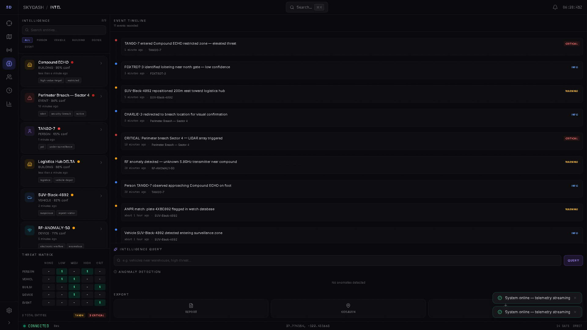
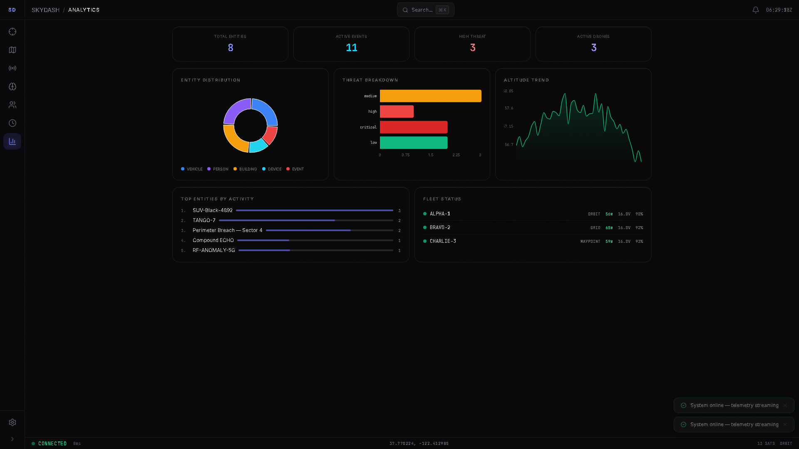
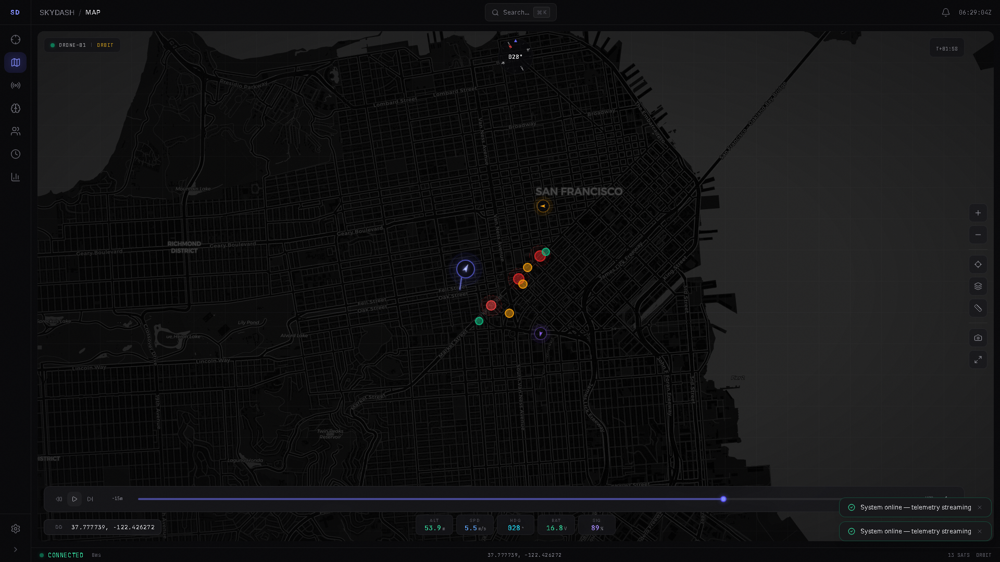
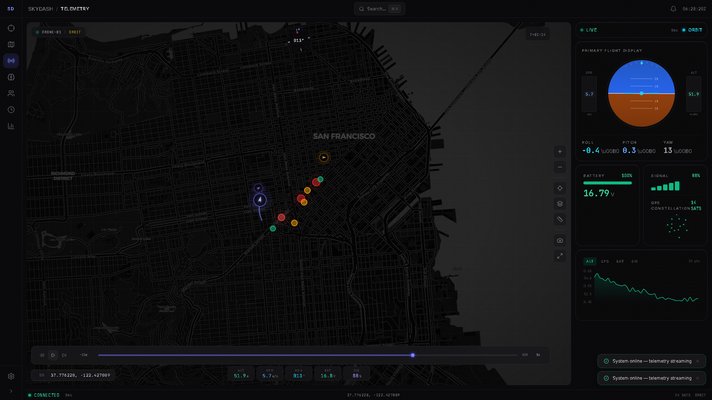

# SkyDash — Open-Source Spatial Intelligence Dashboard

[](https://github.com/mangod12/skydash/actions/workflows/ci.yml)

**Geospatial maps, OSINT-style entities, relationship graphs, missions, exports, and simulated drone telemetry in one local browser workflow.**

SkyDash is an open-source prototype for people who want to study, fork, and extend spatial intelligence workflows without starting from a sales-gated enterprise product.

It is built for:

- Geospatial builders testing map/entity workflows
- OSINT and security practitioners thinking about provenance, relationships, and exports
- Drone and robotics teams exploring telemetry and mission interfaces
- Backend/platform teams evaluating real-time WebSocket systems with a dense operational UI


## What You Can Try In 5 Minutes

Manual development run:

```bash
# Backend
cd backend
pip install -r requirements.txt
python main.py

# Frontend (separate terminal)
cd skydash/frontend
npm install
npm run dev
```

Open http://localhost:5173 and you get:

- A live dashboard with simulated 3-drone telemetry
- A Leaflet map with entities, geofences, heatmaps, annotations, and spatial search
- OSINT-style entity records with relationship/link analysis
- Mission workspaces, alerts, audit logs, and report/data exports

## Current Status

SkyDash is a local-first engineering prototype, not production investigation software.

- Telemetry is simulated at 10Hz today
- MAVLink support is currently an adapter stub
- SQLite is used for local persistence
- No breached data, private-account scraping, or black-box enrichment is included
- Production use would need auth/RBAC, audit hardening, stronger data governance, and real integrations

## Feedback I Need

If you work in geospatial, OSINT, drones, security tooling, or real-time systems, the most useful feedback is:

1. Which integration should come first: PostGIS, STIX/TAXII, OpenCTI/MISP, MAVLink, Cesium, or plugins?
2. What would make the data model more credible for a real workflow?
3. What should be removed or constrained to make the tool safer for beginners?

## Why This Exists

Spatial intelligence tools are powerful, but many of the workflows are hard to inspect because they live behind procurement, demos, and enterprise pricing.

SkyDash is a local, hackable version of the core interface ideas: entity tracking, link analysis, geospatial context, mission workflow, exports, and telemetry. It is meant to be inspected, criticized, and extended.

Started as a single-drone telemetry dashboard. Grew into a 126-file, 12,600-line spatial intelligence platform across 16 development phases.

## Features

### Geospatial Intelligence
- **Dark map** with satellite toggle, 8 toggleable layers, coordinate display (DD/DMS/UTM/MGRS)
- **Activity heatmap** — canvas-based entity density visualization
- **Spatial radius search** — click map, set radius, find entities within range (haversine)
- **Map annotations** — text labels, numbered pins, arrows, circles
- **Split-view dual map** — side-by-side comparison with sync toggle
- **Geofence zone manager** — named zones with entry/exit alerts, color coding
- **Measure tool**, compass rose, grid overlay, ADS-B aircraft tracking

### Intelligence & OSINT
- **Entity system** — CRUD for people, vehicles, buildings, devices, events, organizations
- **Link analysis graph** — D3 force layout with centrality scoring, shortest path, community detection
- **Pattern detection** — spatial clustering, temporal bursts, hub entities, movement corridors, threat escalation
- **Entity comparison** — side-by-side diff with property highlighting and shared relationship detection
- **Auto-link suggestions** — proximity, temporal overlap, tag match, and type affinity heuristics
- **Evidence chain** — provenance tracking with chain of custody visualization
- **Natural language queries** — "high threat vehicles near warehouse"
- **Anomaly detection** — 2-sigma deviation + trend analysis on telemetry
- **Entity filter bar** — multi-select type, threat, confidence, sort
- **Bulk operations** — multi-select entities for batch tag, threat level, mission assignment, or delete

### Missions & Workflow
- **Mission workspace** — create investigations, link entities, analyst notes, map bookmarks
- **Alert rules engine** — 6 configurable rules (battery, signal, altitude, speed, geofence) with cooldown
- **Notification center** — categorized, filterable, mark-read, severity indicators
- **Audit log** — 500-entry action trail with category filtering and CSV export
- **Saved searches** — bookmark filter presets and map views, recall with one click
- **Workspace presets** — Operator / Analyst / Commander modes

### Drone Telemetry
- **WebSocket streaming** — 10Hz real-time from 3 simulated drones (orbit/grid/waypoint)
- **SVG flight instruments** — attitude indicator, compass rose, battery gauge, signal meter, GPS sky view
- **Drone command panel** — flight mode selector, altitude/speed sliders, emergency stop
- **Fleet sparklines** — per-drone altitude and battery mini-charts
- **ADS-B aircraft tracking** — OpenSky API integration with fallback simulation
- **MAVLink adapter** (stub) — ready for real ArduPilot/PX4 hardware

### Export & Reporting
- **5 export formats** — GeoJSON, KML (styled placemarks), CSV (with relationships), entity dossier, mission brief
- **Printable intel report** — 7-section military format (exec summary, entity inventory, threat assessment, relationships, timeline, notes, fleet status)
- **System health monitor** — live sparklines for WebSocket latency, message rate, memory usage

### Design & UX
- **3 themes** — Midnight (dark/indigo), Tactical (green-on-black military), Arctic (light/blue)
- **Glass morphism** — backdrop blur, transparency layers, inner shadows, top highlights
- **Boot sequence** — JARVIS-style startup with progress bar and system diagnostics
- **Command palette** — Ctrl+K omnisearch across entities, missions, events, annotations, commands
- **11 keyboard shortcuts** — full keyboard-first navigation
- **Right-click context menus** — 7 actions on map, 7 actions on entities
- **Responsive** — desktop, tablet (sidebar collapse), mobile (bottom nav)
- **Onboarding tour** — 8-step guided walkthrough for first-time users
- **Virtual lists** — handles 1000+ entities at 60fps

## Screenshots

### Operations Dashboard
Stat cards, mini-map with fleet positions, per-drone sparklines, merged activity feed.


### Intelligence View
Entity list with filter bar, link analysis graph with community detection, timeline, pattern detection, entity comparison.



### Analytics View
Risk scoring, entity metrics, activity trends, and operational summaries for reviewing the current workspace.



### Full Map
8 toggleable layers, spatial search, annotations, geofence zones, split-view comparison, heatmap.



### Telemetry & Drone Command
SVG instruments, multi-chart streams, drone command panel with flight modes and emergency stop.



## Tech Stack

**Frontend** — React 18, Vite 7, Tailwind CSS 3, Zustand, Framer Motion, Leaflet, D3, Recharts, cmdk, Lucide, date-fns

**Backend** — Python, FastAPI, Uvicorn, Pydantic, SQLite (WAL mode), WebSocket

**Testing** — Vitest (41 unit tests), Playwright (E2E)

## Architecture

```
Frontend (126 source files, 12,600 LOC)
  components/
    common/     18 — GlassCard, Toast, CommandPalette, NotificationCenter,
                     ContextMenu, BookmarkBar, OnboardingTour, AuditLog,
                     AlertRulesConfig, SystemHealth, VirtualList, etc.
    layout/      6 — Shell, Sidebar, TopBar, StatusBar, BottomNav, WorkspaceSwitcher
    map/        17 — MapView, HeatmapLayer, SpatialSearch, MapAnnotations,
                     GeofenceManager, SplitMapView, ComparisonMap, etc.
    telemetry/   9 — AttitudeIndicator, DroneCommandPanel, MultiChart, etc.
    intel/      18 — LinkGraph, PatternPanel, EntityComparison, EvidenceChain,
                     LinkSuggestions, BulkActionsBar, EntityFilterBar, etc.
    views/      10 — Dashboard, Map, Telemetry, Intel, Missions, Analytics, Settings
  stores/       10 — telemetry, map, ui, intel, mission, notification,
                     alertRules, audit, bookmark, provenance
  hooks/        11 — useTelemetry, useAlertEngine, useEntityNavigation,
                     useAuditIntegration, useSystemHealth, etc.
  utils/         7 — coordinates, graphUtils, patternDetector, sanitize, etc.
  styles/        4 — tokens.css, animations.css, tactical.css, arctic.css

Backend (5 modules, 26 endpoints)
  main.py          — FastAPI server, REST API, WebSocket, auth middleware
  simulation.py    — FleetSimulator (3 drones: orbit/grid/waypoint)
  entities.py      — EntityStore (SQLite CRUD + relationships + events)
  missions.py      — MissionStore (SQLite CRUD + notes + entity linking)
  mavlink_adapter.py — MAVLink protocol adapter (stub for real hardware)
```

## Getting Started

### Manual Development

```bash
# Backend
cd backend
pip install -r requirements.txt
python main.py                    # Starts on port 8001

# Frontend (separate terminal)
cd skydash/frontend
npm install
npm run dev                       # Opens on localhost:5173
```

Open http://localhost:5173 — boot sequence plays, then the full dashboard with live telemetry from 3 simulated drones.

### Docker Compose

If you prefer containers:

```bash
docker compose up --build
```

Open http://localhost. The frontend is served by nginx and proxies API/WebSocket traffic to the FastAPI backend.

## Keyboard Shortcuts

| Key | Action |
|-----|--------|
| `D` | Dashboard |
| `M` | Full map |
| `T` | Telemetry |
| `I` | Intel |
| `O` | Missions |
| `A` | Analytics |
| `N` | Notifications |
| `B` | Toggle sidebar |
| `Ctrl+K` | Command palette (omnisearch) |
| `?` | Shortcut overlay |
| `Esc` | Close panel |

## API

Full Swagger docs at `http://localhost:8001/docs`.

**Telemetry**: `GET /telemetry` · `GET /telemetry/{id}` · `WS /ws/telemetry` · `POST /reset`

**Entities**: `GET/POST /api/entities` · `GET/PUT/DELETE /api/entities/{id}` · `POST /api/entities/{id}/relate` · `GET /api/entities/{id}/graph`

**Missions**: `GET/POST /api/missions` · `GET/PUT/DELETE /api/missions/{id}` · `POST/DELETE /api/missions/{id}/entities` · `GET/POST /api/missions/{id}/notes`

**Other**: `GET /api/timeline` · `POST /api/events` · `POST /api/export/geojson` · `POST /api/drone/{id}/command` · `GET /health`

WebSocket auth: set `SKYDASH_API_KEY` env var, pass `?token=` on WS connect.

## Comparison

| Capability | SkyDash | Palantir ($10M+/yr) | Maltego ($6.6K/yr) | ArcGIS ($30K+/yr) | QGroundControl |
|---|---|---|---|---|---|
| Geospatial mapping | Strong | Strong | Minimal | Excellent | Moderate |
| OSINT entities | Strong | Excellent | Strong | None | None |
| Link analysis | Yes | Yes | Excellent | None | None |
| Drone telemetry | Yes | Partial | None | Partial | Excellent |
| Real-time streaming | 10Hz WS | Yes | Partial | Yes | Yes |
| Mission workspace | Yes | Yes | No | No | Yes (flight) |
| Price | **$0** | $1M+ | $66K (10 seats) | $30K+ | $0 |

## Development

```bash
npm --prefix skydash/frontend run build   # Production build
npm --prefix skydash/frontend run test    # Run unit tests (41)
npm --prefix skydash/frontend run lint    # ESLint
npx playwright test                       # E2E tests
```

## Roadmap

- [ ] JWT authentication + RBAC
- [ ] PostgreSQL backend option
- [ ] Real MAVLink adapter integration
- [ ] STIX2/TAXII import/export (OpenCTI interop)
- [ ] CesiumJS 3D globe view
- [ ] Plugin architecture
- [ ] Production Docker hardening and deployment guide

## License

MIT
