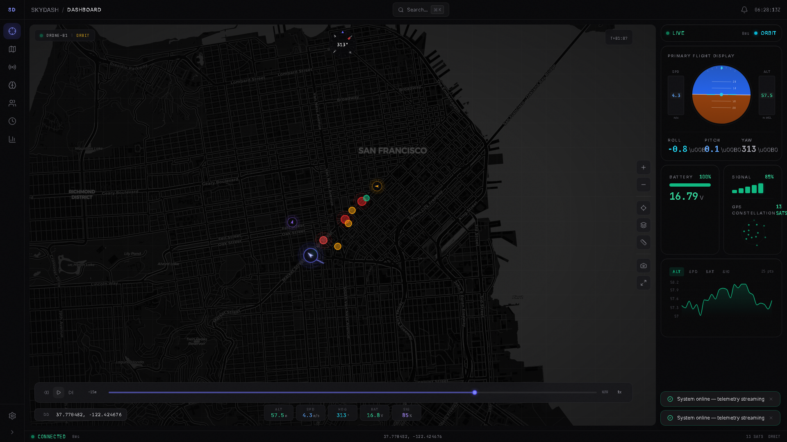

# SkyDash

SkyDash is a spatial intelligence OS for simulated drone fleet operations,
geospatial entity tracking, OSINT-style analysis, mission debriefs, and
operator QA workflows.

It is live on Azure and also runs locally through Docker or separate frontend
and backend processes.

- Live app: https://wonderful-cliff-0325f3800.7.azurestaticapps.net
- Live API: https://skydash-api-38666.azurewebsites.net
- API docs: https://skydash-api-38666.azurewebsites.net/docs
- Current release status: [docs/current-status.md](docs/current-status.md)
- Operations runbook: [docs/skydash-operations-runbook.md](docs/skydash-operations-runbook.md)
- Safety boundary: [docs/safety-and-scope.md](docs/safety-and-scope.md)



## What It Does

SkyDash combines four working surfaces:

- Real-time fleet monitoring: three simulated drones stream telemetry over a
  WebSocket, with HTTP fallback and a live command acknowledgement path.
- Spatial intelligence: map layers, entity markers, ADS-B/OpenSky connector
  data, geofences, measurement tools, heatmaps, overlays, and coordinate
  formats.
- OSINT-style analysis: entities, relationships, events, provenance views,
  natural-language filters, link analysis, threat matrices, comparison views,
  exports, and Shodan connector hooks.
- Mission workflow: mission workspaces, notes, entity linking, debrief tabs,
  optional RT-DETR frame analysis, and briefing/report exports.

The system is built to be inspectable. It is not a real surveillance product,
not a production investigation system, and not a real drone ground-control
station. The public demo uses simulated telemetry.

## Production Demo Status

The current public deployment is:

- Frontend: Azure Static Web Apps, hosted at
  `wonderful-cliff-0325f3800.7.azurestaticapps.net`.
- Backend: Azure App Service for Linux, hosted at
  `skydash-api-38666.azurewebsites.net`.
- WebSocket: `wss://skydash-api-38666.azurewebsites.net/ws/telemetry`.
- CI deploy: GitHub Actions workflow
  `.github/workflows/skydash-azure-static-web-apps.yml` deploys the frontend
  after relevant pushes to `main`.
- Backend deploy: currently direct Azure App Service zip deploy from the
  `backend/` source.

Known live limits:

- Drone telemetry is simulated.
- Shodan runs in mock/unavailable mode until `SHODAN_API_KEY` is configured.
- RT-DETR vision is optional and disabled on the base Azure API unless the
  heavier vision dependencies are installed.
- Auth exists in the backend, but the public demo is configured as an open demo.

## Tech Stack

- Frontend: React 18, Vite 8, Tailwind CSS, Zustand, Framer Motion, Leaflet,
  Deck.gl, Recharts, cmdk, Lucide icons.
- Backend: FastAPI, Uvicorn, Pydantic, WebSockets, SQLite with lightweight
  migrations.
- Connectors: OpenSky/ADS-B and Shodan routes with ingest endpoints.
- Optional local analysis runner: SkyDash Intel Crew in `skydash_intel_crew/`.
  It is not part of the production Azure runtime.
- Testing: Vitest, Playwright, pytest, and optional CrewAI smoke tests.
- Deployment: Azure Static Web Apps, Azure App Service, Docker Compose for
  local operation.

## Repository Shape

```text
backend/
  main.py                  FastAPI entry point and middleware
  deps.py                  shared config, stores, connectors, telemetry history
  simulation.py            simulated multi-drone fleet and command state
  entities.py              entity, relationship, and event store
  missions.py              missions, notes, linked entities, detections
  routes/
    telemetry.py           REST telemetry, command ACK, reset, WebSocket stream
    entities.py            entity CRUD, graph, timeline, events
    missions.py            mission CRUD, links, notes
    connectors.py          ADS-B/OpenSky and Shodan search/ingest
    export.py              GeoJSON and CSV exports
    vision.py              optional RT-DETR status, feed, detection routes
    auth_routes.py         optional user/auth routes

skydash/frontend/src/
  components/              dashboard, map, telemetry, intel, mission, common UI
  hooks/                   telemetry, keyboard, map/context, alerts, console
  stores/                  Zustand stores for app domains
  utils/                   coordinates, exports, NLQ, scenarios, runtime config

skydash_intel_crew/
  src/skydash_intel_crew/  CrewAI orchestration and source snapshot tooling
  tests/                   CrewAI smoke tests

docs/
  current-status.md        live release status and verification baseline
  skydash-operations-runbook.md
  safety-and-scope.md
```

Current tree facts:

- Frontend `src`: 225 JS/JSX/CSS files, including tests.
- Backend: 22 Python files.
- Playwright: 74 E2E test cases.
- Frontend unit tests: 141 Vitest tests.
- Backend tests: 4 pytest tests.
- CrewAI smoke tests: 10 pytest tests.

## Run Locally

### Docker Compose

```powershell
docker compose up --build -d
docker compose ps
Invoke-RestMethod http://localhost:8001/health
```

Open http://localhost.

### Separate Processes

Backend:

```powershell
cd backend
pip install -r requirements.txt
python main.py
```

Frontend:

```powershell
cd skydash/frontend
npm install
$env:VITE_API_URL='http://localhost:8001'
npm run dev
```

Open http://localhost:5173.

## CrewAI Stack

The optional CrewAI operating-readiness runner lives in
[skydash_intel_crew](skydash_intel_crew/README.md). It can read the local
SkyDash docs/source snapshot and inspect live readiness URLs. It is not running
in the Azure frontend or backend.

Docker profile:

```powershell
docker compose --profile crew run --rm crewai
```

Local smoke tests:

```powershell
cd skydash_intel_crew
uv run pytest
```

LLM provider options are configured through `.env` only when running the
optional crew manually.

## API

Local docs are available at http://localhost:8001/docs.
Live docs are available at https://skydash-api-38666.azurewebsites.net/docs.

Important routes:

- `GET /health`
- `GET /telemetry`
- `GET /telemetry/{drone_id}`
- `POST /api/drone/{drone_id}/command`
- `WS /ws/telemetry`
- `GET /api/telemetry/history`
- `GET /api/telemetry/stats`
- `GET /api/entities`
- `POST /api/entities`
- `GET /api/entities/graph`
- `GET /api/timeline`
- `GET /api/missions`
- `POST /api/missions`
- `GET /api/connectors/adsb`
- `GET /api/connectors/shodan`
- `POST /api/connectors/adsb/ingest`
- `POST /api/connectors/shodan/ingest`
- `GET /api/vision/status`
- `POST /api/missions/{mission_id}/detections/analyze`
- `GET /api/export/telemetry/csv`
- `GET /api/export/entities/csv`
- `POST /api/export/geojson`
- `POST /reset`

## Verification

Run the core local checks:

```powershell
npm --prefix skydash/frontend run lint
npm --prefix skydash/frontend run test -- --run
npm --prefix skydash/frontend run build
python -m compileall backend
cd backend; python -m pytest tests; cd ..
cd skydash_intel_crew; uv run pytest; cd ..
```

Production smoke:

```powershell
$env:PLAYWRIGHT_BASE_URL='https://wonderful-cliff-0325f3800.7.azurestaticapps.net'
$env:PLAYWRIGHT_API_URL='https://skydash-api-38666.azurewebsites.net'
npx playwright test e2e/skydash.spec.js e2e/interactions.spec.js -g "app boots|backend API returns fleet telemetry|drone command panel uses backend ACK|OSINT ingest panel previews"
```

## Documentation Map

- [docs/current-status.md](docs/current-status.md): current live deployment,
  verification baseline, and open production gaps.
- [docs/skydash-operations-runbook.md](docs/skydash-operations-runbook.md):
  local, Azure, CI, and release commands.
- [docs/safety-and-scope.md](docs/safety-and-scope.md):
  misuse boundaries and real-drone limits.

## License

MIT
